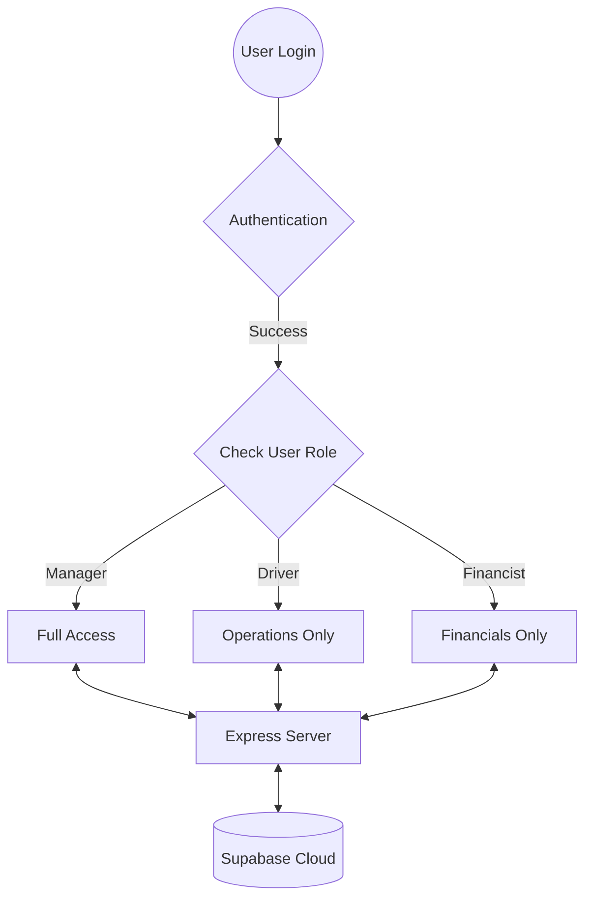

# 🚛 FleetFlow Enterprise ERP
### Industrial-Grade Fleet Management & Logistics Suite

FleetFlow is a comprehensive Enterprise Resource Planning (ERP) solution designed for modern logistics, vehicle tracking, and financial telemetry. Built with a robust React frontend and a Supabase-powered backend, it provides real-time visibility into fleet operations, maintenance, and profitability.

---

## 🚀 Core Features

### 📊 Intelligence & Analytics
* **Command Center**: Real-time dashboard with critical KPIs (Net Profit, Gross Revenue, Operating Costs).
* **Deep Analytics**: Performance telemetry, ROI indexing by asset, and personnel safety standings.
* **Financial Ledger**: Consolidated Loss & Profit architecture with automated fuel and maintenance tracking.

### 🛡️ Role-Based Access Control (RBAC)
Tailored functional environments based on corporate departments:
* **Manager/Dispatcher**: Full administrative control over all modules.
* **Financist**: Access restricted to financial logs, P&L reports, and analytics.
* **Driver**: Access restricted to vehicle telemetry, trip dispatching, and mission manifests.

### 🚛 Operations & Assets
* **Vehicle Registry**: Track status (Operational, Dispatched, Maintenance, Retired) and technical specifications.
* **Trip Dispatcher**: Mission-critical deployment with real-time route management and cargo manifest tracking.
* **Maintenance Logs**: Technical service history with automatic vehicle status synchronization.
* **Personnel Management**: Safety scores, license compliance tracking, and activity logging.

### 🌓 Premium UX/UI
* **Industrial Dark Mode**: High-contrast, premium dark theme with custom scrollbars and glassmorphism cards.
* **Fully Responsive**: Optimized for Desktop (Command Centers) and Mobile (On-the-go drivers).
* **HUD Aesthetics**: Technical UI with scanlines, pulsing telemetry indicators, and industrial animations.

---

## 🛠️ Technology Stack

| Layer | Technology |
| :--- | :--- |
| **Frontend** | React 18, Vite, Lucide Icons |
| **Styling** | Vanilla CSS3 (Custom Design System, Flex/Grid) |
| **Backend** | Node.js, Express.js |
| **Database** | Supabase (PostgreSQL) |
| **Authentication** | Custom JWT/Bcrypt Implementation |
| **Diagramming** | Mermaid.js |

---

## 🏗️ System Architecture



---

## 📦 Installation & Setup

### Prerequisites
* Node.js (v16+)
* Supabase Account

### 1. Project Initialization
```bash
# Clone the repository
git clone <repository-url>
cd odoo

# Install dependencies
npm install
```

### 2. Environment Configuration
Create a `.env` file in the root directory:
```env
SUPABASE_URL=your_supabase_url
SUPABASE_ANON_KEY=your_supabase_anon_key
PORT=3001
```

### 3. Execution
```bash
# Start the Backend Server (Port 3001)
npm run server

# Start the Frontend Development Server (Port 5173)
npm run dev
```

---

## 📁 Project Structure

```text
├── server/               # Express Backend
│   ├── routes/           # API Endpoints (Auth, Trips, Fuel, etc.)
│   ├── database.js       # Supabase Client Configuration
│   └── index.js          # Server Entry Point
├── src/                  # React Frontend
│   ├── components/       # Reusable UI (Sidebar, Modal, etc.)
│   ├── context/          # FleetContext (Global State & API Calls)
│   ├── pages/            # View Layers (Dashboard, Analytics, etc.)
│   ├── App.jsx           # Main Routing & Access Control
│   └── index.css         # Global Design System & Variables
└── public/               # Static Assets
```

---

## 🔒 Security & Optimization
* **Bcryptjs**: Password hashing for secure credential storage.
* **CORS**: Configured for secure frontend-backend communication.
* **Normalization**: Automated snake_case (DB) to camelCase (React) data mapping.
* **Adaptive Loaders**: Blur-filter loading overlays for smooth data synchronization.

---
*Created by [Your Name/Rishi Nileh Solanki] — Optimized for Enterprise Performance.*
